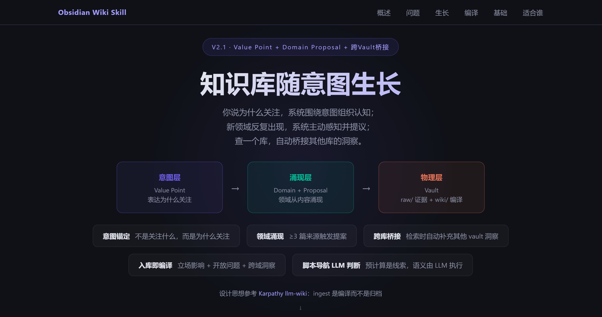
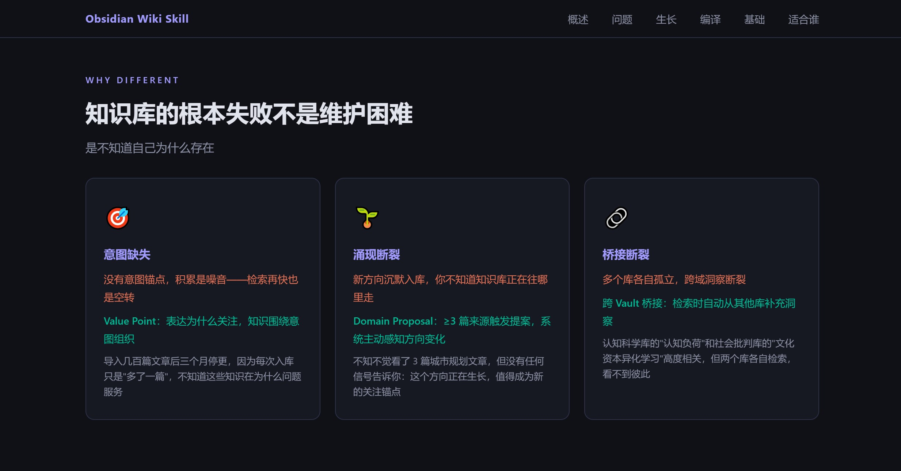

# Obsidian Wiki Skill

[English](README.en.md) | [简体中文](README.md)

**A knowledge system that grows with your intent.**

You say why you care; the system organizes knowledge around intent. New domains emerge from content; the system senses and proposes. Query one vault; it automatically bridges insights from others.

Design philosophy inspired by [Karpathy's llm-wiki methodology](https://gist.github.com/karpathy/442a6bf555914893e9891c11519de94f): ingest is compilation, not archival. Knowledge value lies in intent-driven accumulation, association, and growth.

> **Product Overview**: [docs/product-overview.html](docs/product-overview.html) (open in browser)




---

## Why Different

The fundamental failure of personal knowledge bases isn't maintenance difficulty — it's **not knowing why it exists**.

| Failure Mode | Root Cause | Our Solution |
|---------|------|------------|
| Import hundreds of articles, stop updating after 3 months | No intent anchor — accumulation is noise, fast retrieval is still spinning | **Value Point**: express why you care, knowledge organizes around intent |
| New directions enter silently, no one notices | Domains can only be pre-declared, cannot emerge from content | **Domain Proposal**: same domain accumulates ≥3 sources, system actively proposes |
| Multiple vaults isolated, cross-domain insights break | Each vault retrieves independently, can't see other vaults' knowledge | **Cross-Vault Bridging**: retrieval automatically supplements insights from matching vaults |

Three-layer architecture:

```
Intent Layer    Value Point     — express "why you care", not "what you care about"
Emergence Layer Domain + Proposal — domains emerge from content, ≥3 sources trigger proposal
Physical Layer  Vault           — raw/ immutable evidence + wiki/ AI-compiled knowledge layer
```

---

## Knowledge Grows with Intent

V2.1 core capability — transforming the knowledge base from passive archive to active growth:

- **Intent Anchoring**: Declare value anchors in purpose.md; ingestion automatically matches intent, knowledge organizes around intent rather than stacking passively
- **Domain Emergence**: Compile produces domains; unmatched ones accumulate. Same domain ≥3 sources → system proposes — "This direction keeps appearing, should it become a new anchor?"
- **Cross-Vault Bridging**: When cross-domain insights point to another vault's focus areas, automatically supplement retrieval top-3, marked with source and bridge logic
- **Routing Suggestions**: Post-ingest, if domain matches another vault better, impact report shows suggestion; user can migrate with one command

## Ingest as Compilation

V2.0 core mechanism — ingestion is not archival, it's cognitive compilation:

- **Stance Impact Detection**: reinforce / contradict / extend — not just "written successfully"
- **Open Question Advancement**: open → partial → resolved, automatically links to existing questions
- **Cross-Domain Insights**: methodology transfer, causal structure analogy, abstract pattern sharing — with bridge_logic and migration conclusions
- **9x Deep Reading**: Long documents auto-chunk → per-chunk extraction → cross-chunk synthesis, claim density 9x vs. surface reading
- **Schema Auto-Correction**: Compile output nesting errors, enumeration deviations auto-corrected

## Infrastructure

Multi-source ingestion, natural language query, deep research, maintenance automation — stable and reliable, supporting upper value layers:

**Multi-Source Unified Ingestion**

| Source | Supported |
|------|------|
| WeChat articles | ✅ |
| General web pages | ✅ |
| YouTube / Bilibili / Douyin video (subtitle-first, ASR fallback) | ✅ |
| Video collections/channels (checkpoint resume + cooldown) | ✅ |
| Local Markdown / PDF / HTML / TXT | ✅ |
| DOCX / PPTX / XLSX / EPUB | ✅ |
| Plain text paste | ✅ |

**Natural Language Smart Query**

```
"What is BEV perception?"           → Quick overview: 3-5 key points + sources
"Prep for meeting on end-to-end driving" → Cognitive brief: key points + counter-arguments + discussion questions
"Compare BEV vs. pure vision"       → Comparative analysis: comparison table + key differences
"Deep research on end-to-end driving production viability" → Deep research: 9-stage hypothesis-driven protocol
```

**Deep Research**: Hypothesis-driven 9-stage protocol + 7 red-line quality gates, all assertions carry evidence tags `[Fact]` / `[Hypothesis X%]` / `[Gap]`

**Conversation Insight Capture**: LLM automatically identifies valuable Q&A (10-signal scoring), user says "precipitate" to ingest

**Automated Maintenance**: Health scores, Review Sweep, synthesis refresh, structured maintenance suggestions

**Knowledge Graph**: Mermaid static graphs + domain subgraphs + main graph noise reduction

---

## Quick Start

```powershell
# 1. Install dependencies (add --china for China mirrors)
python scripts/check_deps.py --install

# 2. Initialize Vault
python scripts/init_vault.py --vault "D:\Obsidian\MyVault"

# 3. Ingest (Claude Code interactive recommended)
# Just give a URL in Claude Code conversation, say "ingest"

# 4. Query (natural language)
# Just say: "What's the technical roadmap for end-to-end driving?"

# 5. Daily maintenance
python scripts/wiki_lint.py --vault "D:\Vault"
python scripts/stale_report.py --vault "D:\Vault" --auto-suggest
python scripts/review_queue.py --vault "D:\Vault" --sweep
```

---

## Who Is This For

✅ Want knowledge base to grow around intent, not passively stack articles
✅ Want to know where the knowledge base is heading — sense emerging domains
✅ Multiple vaults with automatic cross-vault insight bridging
✅ Need to track domain progress and form own stances and cognition
✅ Use Claude Code daily, need a persistent knowledge foundation

❌ Only need one-time web summaries
❌ Don't use Obsidian
❌ Don't accept local scripts + filesystem workflow

---

## Requirements

- **OS**: Windows (PowerShell), Linux/Mac unofficial support
- **Python**: 3.11+
- **Obsidian Desktop**: Local vault
- **Claude Code**: Recommended (interactive ingest quality highest)

Core Python dependencies: zero (all stdlib). Per-source dependencies installed as needed, see [docs/SPEC.md](docs/SPEC.md).

---

## Documentation Index

| Document | Content |
|------|------|
| [docs/product-overview.html](docs/product-overview.html) | Product overview (value architecture + capabilities, open in browser) |
| [docs/SPEC.md](docs/SPEC.md) | Design philosophy, architecture, full feature specification |
| [references/setup.md](references/setup.md) | Environment setup & dependency installation (with China mirror guide) |
| [references/workflow.md](references/workflow.md) | Operation modes, pipeline, vault structure, page conventions |
| [references/interaction.md](references/interaction.md) | User conversation routing, post-ingest guidance template |
| [references/ingest-guide.md](references/ingest-guide.md) | Ingest behavior guide (5-stage pipeline + compilation strategy) |
| [references/query-guide.md](references/query-guide.md) | Query behavior guide (smart retrieval + synthesis + 9 output formats) |
| [references/research-guide.md](references/research-guide.md) | Deep research behavior guide (9-stage protocol overview) |
| [references/maintenance-guide.md](references/maintenance-guide.md) | Maintenance behavior guide (lint / review / archive / graph) |
| [references/deep-research-protocol.md](references/deep-research-protocol.md) | 9-stage deep research protocol details |

---

## License

MIT
