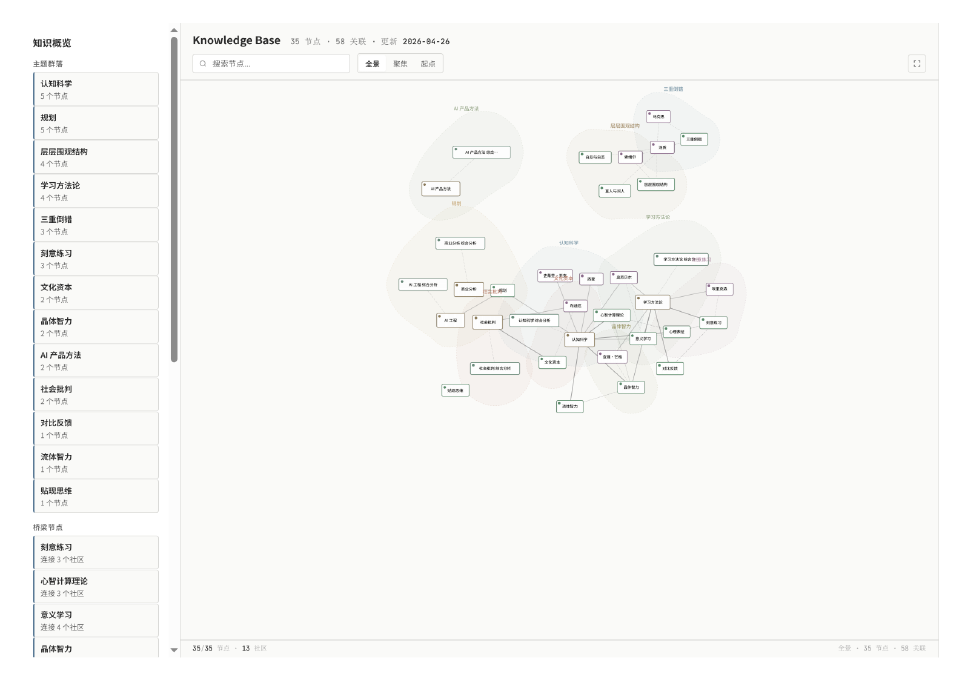

# Obsidian Wiki Skill

[English](README.md) | [简体中文](README.zh-CN.md)

**Compile external knowledge into Obsidian, building a searchable, reasonable, evolvable personal knowledge operating system.**

Not one-off summarization — sediment everything you read into two layers:

```
raw/    ← Immutable source evidence (ultimate ground truth)
wiki/   ← AI-compiled knowledge layer (evolvable, searchable, outputtable)
```

Driven by Claude Code conversations, Python scripts handle the filesystem, Obsidian provides browsing and graph views.

Design philosophy references [Karpathy's llm-wiki methodology](https://gist.github.com/karpathy/442a6bf555914893e9891c11519de94f): ingest is compilation not archiving, LLM compiles raw material into a persistent Wiki, prefer links over duplication, knowledge value lies in being accumulative, relatable, and evolvable.

## Attachment Examples

The repository includes small local-file fixtures and a graph UI preview so the GitHub homepage can show concrete attachment examples instead of only describing them:



- [Sample PDF fixture](references/examples/local-pdf-01.pdf)
- [Low-quality PDF fixture](references/examples/local-pdf-low-01.pdf)

These assets are useful for validating local attachment ingest, binary fixture handling, graph output presentation, and post-ingest asset copying into the vault.

---

## Why Build This

Personal knowledge bases have a common failure mode: after importing hundreds of articles, maintenance stops within three months because **the cost of writing is visible, but the value of reading is not**.

This skill tries to reverse that direction — after each ingest, the knowledge base isn't just "one more article", but:

- Automatically detects this article's **impact on your existing stances** (reinforce / contradict / extend)
- Automatically associates content with **existing open questions** (open question advances → partial → resolved)
- Converts to **directly usable output** under 8 query modes (briefing / meeting materials / article drafts / rebuttal materials)
- Supports 9-phase **hypothesis-driven deep research**, online verification, structured reports with evidence labels
- Displays an **impact report** after ingest: cross-domain insights, open questions, stance impacts — not just "write complete"

---

## Core Capabilities

### 📥 Unified Multi-Source Ingest

| Source | Support |
|--------|---------|
| WeChat public account articles | ✅ |
| Generic web pages | ✅ |
| YouTube / Bilibili / Douyin videos (subtitles first, ASR fallback) | ✅ |
| Video collections/channels (checkpoint resume + cooldown protection) | ✅ |
| Local Markdown / PDF / HTML / TXT | ✅ |
| Plain text paste | ✅ |

Ingest automatically performs **domain-first routing**: detects content topic domains, auto-matches each vault's `purpose.md` focus areas, selects the vault with highest overlap. No need for users to choose repeatedly.

### 🗺️ Knowledge Layer Structure

```
wiki/
  briefs/       ← One-sentence conclusion + key points (quick browsing layer)
  sources/      ← Core summary + associations + claims (distillation layer)
  concepts/     ← Concept pages (cross-source aggregation, upgraded to official node after ≥2 source mentions)
  entities/     ← Entity pages (people/companies/products/methods)
  domains/      ← Domain pages (topic area boundaries and navigation)
  syntheses/    ← Synthesis analysis pages (cross-source synthesis)
  questions/    ← Question tracking (open → partial → resolved → dropped)
  stances/      ← Stance pages (my current judgment on X + evidence)
  comparisons/  ← Structured comparisons (A vs B: dimensions + pros/cons + overall judgment)
  outputs/      ← Temporary work products (graph-hidden, don't pollute main knowledge layer)
```

**Fidelity ranking**: `raw/articles/` > `wiki/sources/` > `wiki/briefs/`

**Page status lifecycle**: `seed` → `developing` (≥1 reference) → `mature` (≥3 references) → `evergreen` (≥6 references). Status auto-upgrades on each ingest.

### 🔍 8 Query Output Modes

```powershell
python scripts/wiki_query.py "<question>" --mode <mode> --vault <path>
```

| Mode | Use case | Output |
|------|----------|--------|
| `brief` | Quick understanding | Source excerpts |
| `briefing` | Pre-meeting prep | Structured briefing: sources + claims + controversies + open questions + stances |
| `draft-context` | Feed to LLM for secondary analysis | Material pack with `[[ref]]` backlinks |
| `contradict` | Find counter-arguments | Strongest rebuttal + steel-man |
| `digest --deep` | Deep research | Multi-source report: background + viewpoints + comparison + unresolved questions |
| `digest --compare` | Tech route comparison | Markdown comparison table |
| `digest --timeline` | Track development trajectory | Mermaid timeline |
| `essay` | Write an article | Draft with arguments + source citations (with `[[ref]]`) |
| `reading-list` | Systematic learning | Topologically sorted reading path |
| `talk-track` | Meeting | Core arguments + rebuttals + discussion questions |

### 📊 Knowledge Graph (Three Forms)

| Graph | Generation | Usage |
|-------|-----------|-------|
| `wiki/graph-view.md` | Mermaid static graph (≤30 node degree pruning) | Render directly in Obsidian |
| `wiki/typed-graph.md` | Typed edges (supports/contradicts/answers/evolves) | `--typed-edges` flag |
| Interactive HTML | D3.js + Louvain community detection + edge weights | Open in browser |

Graph noise reduction convention: `raw/articles/`, `sources/`, `briefs/`, `outputs/` don't enter the main graph; `concepts/entities` need ≥2 source references to enter the main graph.

### 🔬 Deep Research

Hypothesis-driven 9-phase research protocol, combining vault's existing knowledge with online search, producing structured reports with evidence labels.

**Trigger words**: `deep research X` / `深入研究 X` / `系统分析 X`

```
Phase 0: Context collection (hot.md + existing stances/questions)
Phase 1: Intent expansion (uncover the real question)
Phase 2: Hypothesis formation (2-4 falsifiable hypotheses)
Phase 3: Vault evidence classification (F/I/A nodes)
Phase 4: Online research (adaptive rounds, evidence sufficiency gating)
Phase 5: External fact calibration
Phase 6: Root question excavation
Phase 7: Scenario stress testing
Phase 8: Pre-mortem (failure mode analysis)
Phase 9: Convergence + Why/What/How/Trace report
```

All assertions carry evidence labels: `[Fact]` / `[Inference]` / `[Assumption]` / `[Hypothesis X%]` / `[Disputed]` / `[Gap]`

### 🔄 Post-Ingest Impact Report

After each ingest completes, the host agent must display an impact report (not just "write complete"):

```
Ingest complete: {title} → {vault name}
Quick read: [[briefs/{slug}]]
Compile quality: {structured | raw-extract}
New: {N concept candidates, N entity candidates, N open questions}
Cross-domain insights: {concept → domain mapping, bridge_logic}  ← high-signal only
Open questions: {question list}                                  ← high-signal only
```

---

## Quick Start

### 1. Install dependencies

```powershell
# Check and install all dependencies (add --china for Chinese mirrors)
python scripts/check_deps.py --install
# Chinese mirror
python scripts/check_deps.py --install --china
```

Dependency groups: `core` / `wechat` / `video` / `video_asr` / `pdf` / `web`

WeChat fetching depends on [wechat-article-for-ai](https://github.com/bzd6661/wechat-article-for-ai) (Camoufox anti-detection browser).

### 2. Initialize Vault

```powershell
python scripts/init_vault.py --vault "D:\Obsidian\MyVault"
```

### 3. Ingest

```powershell
# Heuristic ingest (no extra API needed)
python scripts/wiki_ingest.py --vault "D:\Vault" --no-llm-compile "https://mp.weixin.qq.com/s/..."

# YouTube video
python scripts/wiki_ingest.py --vault "D:\Vault" --no-llm-compile "https://www.youtube.com/watch?v=..."

# Local file
python scripts/wiki_ingest.py --vault "D:\Vault" --no-llm-compile "D:\notes\article.pdf"
```

**Claude Code interactive ingest (recommended, higher quality)**:

Just give a URL in Claude Code conversation and say "ingest" or "落盘". The skill automatically:
1. Fetches content → writes to `raw/`
2. Generates lean compile context (`--prepare-only --lean`, ~10KB, ~80% context reduction)
3. Claude Code generates v2 structured JSON in conversation (with knowledge_proposals / cross_domain_insights / claim_inventory / open_questions)
4. `apply_compiled_brief_source.py` writes to all `wiki/` layers, refreshes taxonomy/synthesis/delta
5. Displays post-ingest impact report

### 4. Query

```powershell
# Pre-meeting prep
python scripts/wiki_query.py "end-to-end autonomous driving tech routes" --mode briefing --vault "D:\Vault"

# Article material
python scripts/wiki_query.py "BEV vs pure vision core debate" --mode essay --vault "D:\Vault"

# Strongest rebuttal
python scripts/wiki_query.py "contradict pure-vision is safe enough" --mode contradict --vault "D:\Vault"
```

### 5. Routine maintenance

```powershell
# Health check
python scripts/wiki_lint.py --vault "D:\Vault"

# Blind-spot detection (which domains lack questions/stances/syntheses)
python scripts/stale_report.py --vault "D:\Vault" --blind-spots

# Refresh synthesis pages
python scripts/refresh_synthesis.py --vault "D:\Vault"

# Knowledge graph (Mermaid + typed edges)
python scripts/export_main_graph.py --vault "D:\Vault" --typed-edges

# Review queue
python scripts/review_queue.py --vault "D:\Vault" --write

# Archive duplicate outputs
python scripts/archive_outputs.py --vault "D:\Vault" --apply
```

---

## Architecture Overview

```
obsidian-wiki-skill/
  SKILL.md              ← 56 lines, host-agent routing table (loads references/ by task condition)
  manifest.yaml         ← 6 sub-skill definitions (ingest/review/query/helper/video/deep-research)

  scripts/
    wiki_ingest.py      ← Main orchestrator (domain-first routing + multi-source adaptation)
    wiki_query.py       ← Query entrypoint (8 output modes)
    wiki_lint.py        ← Health check
    llm_compile_ingest.py ← LLM compile (--prepare-only --lean interactive mode, ~10KB payload)
    apply_compiled_brief_source.py ← Write back host-agent structured JSON

    adapters/           ← Source adapter package (wechat/web/video/local/text/collection/...)
    pipeline/           ← Pipeline core (fetch/ingest/compile/apply/output/...)
    kwiki/              ← CLI entrypoint (python -m kwiki <stage>)

  references/           ← Per-topic docs (lazy-loaded, not all in context)
    workflow.md         ← pipeline + vault structure + page status lifecycle
    interaction.md      ← User dialog routing + post-ingest guidance template
    pipeline-scripts.md ← ingest / compile / apply script details
    deep-research-protocol.md ← 9-phase research protocol
    stance-schema.md    ← Stance page template
    question-schema.md  ← Question tracking template
    output-modes.md     ← 8 query mode descriptions
    examples/           ← agent_interactive_compiled_result.json and other examples
    ...

  docs/SPEC.md          ← Full product & technical specification (not loaded at runtime)
```

### Execution Mode Comparison

| Mode | Compiler | Extra API needed | Quality | Use case |
|------|----------|-----------------|---------|----------|
| **Claude Code interactive** | Claude Code itself | No | Highest | Daily ingest, single-article deep read |
| **Script direct API** | External OpenAI-compatible endpoint | Yes | Depends on model | Batch processing, scheduled tasks |
| **Heuristic (no-llm)** | Rule extraction | No | Basic | Quick first-pass, offline use |

### v2 Compile Output Fields

Interactive ingest uses v2 schema; host-agent JSON includes:

| Field | Description |
|-------|-------------|
| `compile_target` | Compile target metadata (vault, slug, title, author, date) |
| `document_outputs` | brief (one_sentence + key_points) + source (core_summary + contradictions + reinforcements) |
| `knowledge_proposals` | domains / concepts / entities each with action (link_existing / create_candidate / no_page) and confidence |
| `update_proposals` | Update suggestions for existing pages (written to `wiki/outputs/` delta drafts, not directly overwritten) |
| `claim_inventory` | Core claim list with claim_type / confidence / verification_needed |
| `open_questions` | Trackable questions derived from content |
| `cross_domain_insights` | Cross-domain analogical reasoning (mapped_concept → target_domain + bridge_logic + potential_question) |
| `stance_impacts` | Impacts on existing stance pages |
| `review_hints` | Review priority and suggestions |

**Note**: v2 JSON must have `"version": "2.0"` as a top-level key for `apply_compiled_brief_source.py` to identify the schema version. `core_summary` must be a list of strings, not a single string.

---

## Requirements

- **OS**: Windows (PowerShell), Linux/Mac unofficially supported
- **Python**: 3.11+
- **Obsidian Desktop**: Local vault

Core Python dependencies are zero (all stdlib). Install per source type as needed:

| Source | Extra dependencies |
|--------|-------------------|
| WeChat public accounts | `camoufox[geoip]` + `markdownify` + `beautifulsoup4` + `httpx` |
| Video (subtitles) | `yt-dlp` |
| Video (no subtitle ASR) | `faster-whisper` |
| PDF | `pypdf` |
| Generic web | `baoyu-url-to-markdown` (npm) |

### Environment Variables

New env vars use `KWIKI_*` prefix; old `WECHAT_WIKI_*` prefix auto-compatible via `env_compat.py`:

| New name | Old name | Description |
|-----------|----------|-------------|
| `KWIKI_WEB_ADAPTER_BIN` | `WECHAT_WIKI_WEB_ADAPTER_BIN` | Web adapter command |
| `KWIKI_VIDEO_ADAPTER_BIN` | `WECHAT_WIKI_VIDEO_ADAPTER_BIN` | Video adapter command |
| `KWIKI_API_KEY` | `WECHAT_WIKI_API_KEY` | LLM API key |
| `KWIKI_COMPILE_MODEL` | `WECHAT_WIKI_COMPILE_MODEL` | LLM compile model |
| `KWIKI_WECHAT_TOOL_DIR` | `WECHAT_ARTICLE_FOR_AI_DIR` | wechat-article-for-ai path |
| `KWIKI_DEPS_DIR` | `WECHAT_ARTICLE_PYTHONPATH` | Python dependency path |

Full env var list in [references/setup.md](references/setup.md).

---

## Common Failures

| Problem | Troubleshooting |
|---------|----------------|
| WeChat URL failure | Check `.tools\wechat-article-for-ai` exists, `KWIKI_WECHAT_TOOL_DIR` is set |
| Web URL failure | Check `baoyu-url-to-markdown` is on PATH, classify as `browser_not_ready` or `network_failed` |
| Bilibili HTTP 412 | Login state issue, check `cookies.txt` |
| Repeated collection failures | Check `wiki/import-jobs/*.md` for `cooldown_until` |
| v2 JSON apply error | Check top-level `"version": "2.0"` exists, `core_summary` is a list |

---

## Tests

```powershell
python -m pytest tests/ -q
```

93 passed, 4 pre-existing failures (due to wechat-article-for-ai not installed).

---

## Documentation Index

| Document | Contents |
|----------|----------|
| [docs/SPEC.md](docs/SPEC.md) | Full product & technical specification |
| [references/setup.md](references/setup.md) | Environment config & dependency installation (including China mirror guide) |
| [references/workflow.md](references/workflow.md) | Operating modes, pipeline, vault structure, page conventions, status lifecycle |
| [references/interaction.md](references/interaction.md) | User dialog routing, post-ingest guidance template, status vocabulary |
| [references/pipeline-scripts.md](references/pipeline-scripts.md) | ingest / compile / apply script details |
| [references/deep-research-protocol.md](references/deep-research-protocol.md) | 9-phase deep research protocol |
| [references/output-modes.md](references/output-modes.md) | 8 query mode details |
| [references/stance-schema.md](references/stance-schema.md) | Stance page template & state machine |
| [references/question-schema.md](references/question-schema.md) | Question tracking template |
| [references/video-rules.md](references/video-rules.md) | Video processing & collection protection rules |
| [references/cross-project-access.md](references/cross-project-access.md) | Cross-project read-only vault access |

---

## Design Principles

**Two-layer evidence principle**: `raw/` is the ultimate evidence layer, permanently immutable; `wiki/` is the evolvable compilation layer, iteratively maintained. Exact numbers/dates/verbatim quotes must be verified against `raw/`; understanding and analysis use `wiki/`.

**Host-agent first**: Claude Code is the primary entry, scripts are support. AI does semantic understanding, scripts do file operations. User experience is conversation, not command-line sequences.

**Concept maturity threshold**: concept/entity pages are not created for "mentioned once" — must have ≥2 stable source references to upgrade to an official graph node, avoiding knowledge graph pollution.

---

## Who Is This For

✅ Want to sediment WeChat/video/web/file content into Obsidian, not just one-off summaries  
✅ Need to track latest developments in a domain, forming own stances and understanding  
✅ Frequently need to quickly organize existing knowledge for meetings, writing, decisions  
✅ Use Claude Code for daily work, need a persistable knowledge foundation  
✅ Want automatic routing in multi-vault scenarios, different topics going to their own places  

❌ Only need one-off web page summaries  
❌ Don't use Obsidian  
❌ Don't accept local scripts + filesystem workflows  

---

## License

MIT
