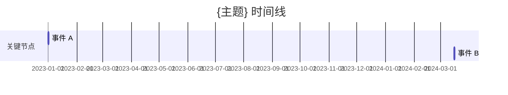

# 查询行为指南

LLM 驱动的查询工作流。你理解用户意图、调用检索脚本获取结构化上下文、综合答案、选择输出格式。脚本做机械操作（语义索引构建、智能检索、结果写入）。

## 定位

| 场景 | 职责 | 你做什么 | 脚本做什么 |
|------|------|---------|-----------|
| 查询 | 回答关于知识库的问题 | 搜索 + 理解 + 综合 + 格式化 | 写入 outputs/、更新 index/log |
| 入库后追问 | 围绕已入库文章深入 | 定向读取 raw/ + wiki/ 页面 | 无 |
| 深度研究 | 假说驱动的系统研究 | → 加载 `research-guide.md` | — |

---

## Step 0: 定位 Vault

1. 从 `vault.conf` 或用户指定的 `--vault` 获取路径
2. 多 vault 时按 `purpose.md` 域匹配自动选择
3. 确认 `wiki/index.md` 存在（不存在则提示用户先初始化）。如果 `wiki/semantic-index.json` 不存在，提示运行 `wiki_index_v2.py --rebuild`

---

## Step 1: 理解意图

从用户问题中提取：

- **核心概念**：用于搜索的关键词
- **查询类型**：判断用户想要什么形式的回答

| 用户说的 | 查询类型 | 输出策略 |
|---------|---------|---------|
| "什么是 X"、"X 的定义"、"总结一下" | 快速了解 | 简洁回答，3-5 句 + 来源引用 |
| "深入分析 X"、"全面梳理"、"综述" | 深度综合 | 结构化报告，多来源交叉 |
| "对比 X 和 Y"、"X vs Y"、"区别" | 对比分析 | 对比表 + 关键差异 |
| "X 的发展脉络"、"演变"、"时间线" | 时间线梳理 | 时间排列 + Mermaid 图 |
| "准备讨论 X"、"开会材料"、"汇报" | 会议准备 | 认知简报：要点 + 反面 + 问题 |
| "反驳 X 观点"、"反方"、"质疑" | 反驳质疑 | 最强反面证据 + 冲突信号 |
| "写一篇 X 的文章"、"帮我写" | 文章草稿 | 论点 + 证据 + 叙述结构 |
| "学习 X 的路径"、"系统学习" | 学习路径 | 按依赖排序的推荐阅读 |
| "整理素材给 LLM"、"上下文" | 素材包 | 带编号的来源摘要 + 原文片段 |

**组合需求**：拆成多次查询分别处理。例如"对比 X 和 Y，然后帮我写篇文章"→ 先做对比分析，再基于结果做文章草稿。

**模糊意图**：如果无法判断类型，默认走"快速了解"。回答后追问用户是否需要更深入的形式。

---

## Step 2: 搜索 Vault（智能检索）

**V2.0 核心改进**：用 `wiki_retrieve.py` 替代 LLM 驱动的 grep 搜索。脚本从语义索引中检索、评分、排序，输出结构化上下文包，LLM 直接消费结果。

### 2a. 智能检索（首选）

运行检索脚本获取结构化上下文包：

```bash
python scripts/wiki_retrieve.py --vault "D:\Vault" --query "用户问题" --top-k 5 --read 3
```

脚本自动完成：
1. 解析查询 → 提取核心概念
2. 查语义索引（`wiki/semantic-index.json`）→ 匹配 domain、concept、entity、claim
3. 评分排序 → 综合标题匹配、声明匹配、域匹配、置信度、时效性
4. 读 top-k 页面 → 提取关键段落（核心摘要、关键判断、支持/反对证据）
5. 输出结构化上下文包（JSON）

**输出结构**：
```json
{
  "query": "...",
  "terms": ["提取的搜索词"],
  "top_pages": [{"ref": "sources/xxx", "title": "...", "score": 8.5, "domains": [...]}],
  "claims": [{"text": "...", "confidence": "Working", "source": "sources/xxx"}],
  "relationships": [{"from": "...", "to": "...", "type": "supports"}],
  "page_contents": [{"ref": "sources/xxx", "核心摘要": "...", "关键判断": "..."}]
}
```

**参数调节**：
- `--top-k 8`：需要更广覆盖时（深度综合、对比分析）
- `--read 5`：需要更深上下文时（反驳材料、素材包）
- `--types source,concept`：限定搜索范围（快速了解只要 sources + concepts）

### 2b. 语义索引查询（补充）

当需要快速探索知识库结构时，直接查语义索引：

```bash
python scripts/wiki_index_v2.py --vault "D:\Vault" --query "BEV感知"
```

返回匹配的 domain、concept、entity 和 claim，适合：
- 探索某个领域有哪些内容
- 快速判断 vault 是否覆盖某主题
- 发现相关概念和实体

### 2c. Grep 兜底（仅在索引不可用时）

仅当 `semantic-index.json` 不存在（未运行 `--rebuild`）时，退回 grep 搜索：

```
搜索范围优先级：
1. wiki/sources/    — 保真来源页（信息密度最高）
2. wiki/briefs/     — 快读页（快速概览）
3. wiki/concepts/   — 概念页（定义和边界）
4. wiki/syntheses/  — 综合页（跨来源分析）
5. wiki/entities/   — 实体页
6. wiki/comparisons/ — 对比页
7. wiki/stances/    — 立场页
```

### 2d. 反驳材料收集

`pipeline/output/contradict.py` 提供"潜在对立面"候选页面。脚本使用否定模式（如"并非"、"不是"、"错误"等）做初步筛选，这是**候选材料生成**，不是语义判断。

你从候选材料中筛选真正有价值的反驳证据，按 `query_synthesis.md` 约束分析。不要把脚本的否定模式匹配结果直接当作反驳证据——需要阅读上下文判断是否真正构成反驳。

### 2e. 上下文效率

- 单次查询读取页面控制在 **10 页以内**
- 检索结果中的 `page_contents` 已包含关键段落，通常不需要再读全文
- 仅当问题涉及精确数字、原文引用时，才回到 `raw/articles/` 验证

---

## Step 3: 综合回答

按 `references/prompts/query_synthesis.md` 约束综合回答。

### 洞见识别

回答生成后、展示前，按 `references/prompts/insight_detection.md` 约束判断本轮问答是否有价值。

**判断依据**（你在生成过程中自然掌握）：
- 用户问了什么（问题在上下文中）
- 你引用了哪些来源（`[[页面名]]` 引用）
- 你是否做了跨来源综合（自己正在做的事情）
- 搜索 vault 后找到了多少相关页面

**触发**（总分 ≥ 3）：
1. 写入 `wiki/outputs/{date}--insight--{short-title}.md`（mode: insight, lifecycle: temporary, origin: conversation）
2. 在回答末尾追加：`---\n识别到有价值的洞见，暂存于 [[outputs/{slug}]]。说 "沉淀" 可升级为正式知识页。`

**不触发**：正常回答，不追加任何提示。

### 回答原则

- **Vault 知识优先**：vault 中有的信息，标注来源 `[[页面名]]`
- **模型知识补充**：vault 中没有的，明确标注"（模型知识，vault 中暂无）"
- **诚实告知**：搜索后 vault 中确实没有相关内容时，说"vault 中暂无此主题的笔记"
- **区分事实与推断**：对推断性内容标注"此为分析推断，非原文表述"

### 来源可信度

| 可靠度 | 来源 | 使用方式 |
|--------|------|---------|
| 高 | sources/、briefs/（quality: high） | 直接引用 |
| 中 | concepts/、syntheses/（quality: medium） | 引用 + 建议交叉验证 |
| 低 | outputs/、candidate 页面 | 谨慎引用，标注"待确认" |

### 高精度验证

问题含具体数字、日期、原文引用、作者立场时，必须回看 `raw/articles/` 验证。验证不通过则标注"此数据未经原文验证，仅供参考"。

### 多来源冲突

事实冲突 → 标注"待验证"，建议用户核实。观点冲突 → 并列呈现，不强行统一。

### 引用规范

- 用 `[[页面名]]` 格式引用 wiki 页面
- 精确数字/日期/原文引用必须回看 `raw/` 验证
- 多来源有不同观点时，分别列出并标注来源

---

## Step 4: 选择输出格式

根据 Step 1 判断的查询类型，选择对应的输出格式。

### 格式 A：快速了解

适用：什么是 X、定义、概述

```markdown
## 回答

[3-5 句话核心要点，穿插 [[来源]] 引用]

---
📚 引用了 N 个来源：[[来源1]] [[来源2]] [[来源3]]
💡 模型补充：有/无
```

### 格式 B：深度综合报告

适用：深入分析、综述、全面梳理

```markdown
# {主题} 综合分析

> 综合自 N 个来源 | 日期：{日期}

## 背景概述
[主题的背景和重要性]

## 核心观点
[按重要性排列，每个观点标注来源]

## 不同视角对比
[多来源观点不同时的对比表]

## 知识脉络
[按逻辑顺序梳理]

## 尚待解决的问题
[现有知识中未回答的问题]

## 相关页面
[所有综合来源的链接]
```

### 格式 C：对比分析

适用：对比、比较、X vs Y

```markdown
# {对比主题} 对比分析

> 对比 N 个对象 | 日期：{日期}

## 对比表

| 维度 | 对象 A | 对象 B |
|------|--------|--------|
| 核心观点 | ... | ... |
| 适用场景 | ... | ... |
| 优势 | ... | ... |
| 局限 | ... | ... |
| 来源 | [[来源1]] | [[来源2]] |

## 关键差异
[1-2 句话说清最重要的差异]

## 综合判断
[基于对比的结论]
```

### 格式 D：时间线

适用：演变、发展脉络、时间线

```markdown
# {主题} 发展脉络

> 时间跨度：{起始} ~ {结束} | 日期：{日期}



## 事件说明
- **日期 — 事件**：说明（来源：[[页面]]）

## 相关页面
```

> 时间线注意事项：只有年份时补为 1 月 1 日；连年份都不确定时用纯文字列表替代 Mermaid；事件超过 15 个时按 section 分组。

### 格式 E：认知简报

适用：准备会议、汇报、讨论材料

```markdown
# {主题} 认知简报

> 日期：{日期} | 用途：会议准备

## 一句话核心
[最需要记住的一个点]

## 关键要点（3-5 条）
[按重要性排列，标注来源]

## 反面信号 / 需要注意的
[与主流观点矛盾的信号、风险点]

## 待讨论问题
[会议上应该提出的问题]

## 相关立场
[知识库中已有的立场页]
```

### 格式 F：反驳材料

适用：反驳、反方、质疑

```markdown
# {观点} — 反驳材料

> 日期：{日期}

## 目标观点
[要反驳的观点描述]

## 最强反驳证据
[从 vault 中找到的反对证据，标注来源]

## 冲突信号
[来源之间的矛盾点]

## 潜在反面论点
[即使 vault 中没有直接证据，但逻辑上可能的反驳方向]

## 相关页面
```

### 格式 G：文章草稿

适用：写文章、帮我写

```markdown
# {主题} — 文章草稿

> 综合自 N 个来源 | 日期：{日期}

## 核心论点
[文章要论证什么]

## 论据结构
[支撑论点的证据，标注来源]

## 反论点与回应
[可能的反对意见及回应]

## 叙述大纲
[建议的文章结构]
```

### 格式 H：学习路径

适用：学习路径、系统学习、推荐阅读

```markdown
# {主题} 学习路径

> 日期：{日期}

## 入门（必读）
[基础概念和定义，按依赖排序]

## 进阶（推荐）
[深入分析和对比]

## 专题（按兴趣选读）
[特定方向的深入材料]

## 相关页面
```

### 格式 I：素材包

适用：整理素材给 LLM、上下文

```markdown
# {主题} — 素材包

> 用于二次分析 | 日期：{日期}

## 来源摘要

### [1] {来源标题}
- 核心观点：...
- 关键数据：...
- 原文片段：> ...
- 链接：[[来源页面]]

### [2] {来源标题}
...

## 关系摘录
[来源之间的关联、矛盾、互补]
```

---

## Step 5: 持久化判断

### 写入条件

满足以下条件之一时，建议写入 `wiki/outputs/`：

- 回答引用了 3 个及以上来源的综合分析
- 用户明确要求保存
- 回答包含新的跨来源洞察

### 不写入

- 简单事实查找（"什么是 X"→ 直接回答即可）
- 单来源问答
- 用户说"不用保存"

### 洞见识别触发时的写入

如果 Step 3 中洞见识别已触发（总分 ≥ 3），则自动写入，不需要额外判断。写入格式见 `references/prompts/insight_detection.md`。

### 普通写入操作

```
写入路径：wiki/outputs/{date}--{short-title}.md
frontmatter：
  mode: {实际使用的格式类型}
  lifecycle: temporary
  date: {日期}
  sources: [引用的来源列表]

写入后：
  - 更新 wiki/hot.md
  - 追加 wiki/log.md
  - 重建 wiki/index.md
```

写入操作由脚本 `wiki_query.py` 执行（传入 `--no-writeback` 跳过）。你也可以直接用 Write 工具写入 outputs/ 目录。

### 沉淀提议

**洞见识别触发时**（已自动写入）：
```
识别到有价值的洞见，暂存于 [[outputs/{slug}]]。说 "沉淀" 可升级为正式知识页。
```

**普通写入时**（用户要求保存或综合分析）：
```
这个回答包含了跨来源综合分析，已存入 wiki/outputs/。
要沉淀为正式知识页？说 "note" 走 /note 流程。
```

---

## Step 6: 深度研究引导

回答生成后，判断是否需要建议升级到深度研究。

### 触发信号

| 信号 | 判断规则 | 优先级 |
|------|---------|--------|
| D1. 外部事实依赖 | 答案需要验证外部事实（最新数据、事件、政策），vault 中没有 | high |
| D2. 多源矛盾 | 搜索 vault 后发现 ≥ 2 个来源对同一问题有矛盾回答 | high |
| D3. 高风险决策 | 问题涉及重大决策（方向选择、架构决策、投资判断），且 vault 信息不充分 | high |
| D4. 低覆盖度 | 搜索 vault 后发现 < 2 个相关页面，需要外部补充 | medium |
| D5. 时间敏感 | 问题涉及"最新的"、"最近的"、"当前的"，vault 内容可能已过时 | medium |
| D6. 用户追问 | 用户在同一个话题上追问 ≥ 3 轮，说明查询结果不满足需求 | low |

### 触发规则

满足以下任一条件时，建议升级到深度研究：
- 任一 high 优先级信号命中
- ≥ 2 个 medium 优先级信号命中
- 1 个 medium + 用户追问 ≥ 3 轮

### 触发时

先用 vault 内的信息完整回答，然后在末尾追加一行提示，说明具体原因：

```
这个问题涉及 [外部最新信息 / 来源矛盾 / vault 覆盖不足]，当前回答可能不完整。说 "深入研究" 可启动系统调研。
```

### 不触发时

正常回答，不追加任何提示。

---

## 特殊场景

### 入库后追问

用户围绕已入库文章继续提问时：

1. 定位对应的 `raw/articles/` 和 `wiki/sources/` 页面
2. 优先从这些页面中找答案
3. 如果问题超出当前文章范围，扩展到 wiki 全局搜索
4. 如果问题涉及外部事实验证，建议升级到 deep-research

### 多 Vault 查询

当用户有多个 vault 时：

1. 先按 `purpose.md` 判断哪个 vault 最相关
2. 如果问题跨域，分别查询各 vault 后综合
3. 不要默认查所有 vault——先判断域

### Vault 中无相关内容

搜索后 vault 确实没有相关内容时：

1. 诚实告知："vault 中暂无此主题的笔记"
2. 用模型知识回答，明确标注"（模型知识，vault 中暂无）"
3. 如果问题有价值，建议用户后续入库相关材料

### 高精度信号

问题包含以下信号时，必须回到 `raw/articles/` 验证：

- 具体数字（"2024 年市场规模"）
- 日期（"去年 3 月"）
- 原文引用（"作者原话是..."）
- 作者立场（"XX 认为..."）

不要仅依赖 brief/source 页面的压缩信息回答这类问题。

---

## 上下文效率

### 搜索策略

- 首选 `wiki_retrieve.py` 智能检索，不盲目全文搜索
- 检索结果的 `page_contents` 已包含关键段落，通常不需要再读全文
- 长页面（>2000 字）只读 frontmatter + 核心段落
- 优先读 sources/ 和 briefs/，syntheses/ 和 comparisons/ 作补充

### 避免

- 不要一次性读取整个 vault
- 不要重复读取已读页面
- 不要把 outputs/ 页面作为主要信息源（它们是衍生内容）
- 不要把 candidate 页面的信息当作已确认事实

### 索引维护

入库完成后自动重建语义索引（`wiki_index_v2.py --rebuild`），确保检索结果反映最新内容。

---

## 边界

- **你负责**：意图理解、搜索策略、相关性排序、格式选择、综合回答、来源标注
- **脚本负责**：索引重建、结果写入 outputs/、更新 hot.md/log.md
- **不主动修改**：正式 wiki 页面（sources/、briefs/、concepts/ 等），除非用户明确要求
- **outputs/ 是临时工作区**：查询结果默认写入 outputs/，不自动升级为正式页面
